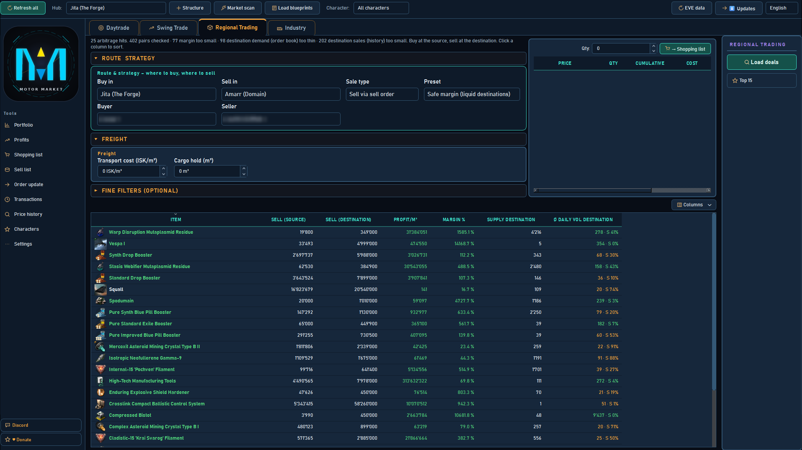
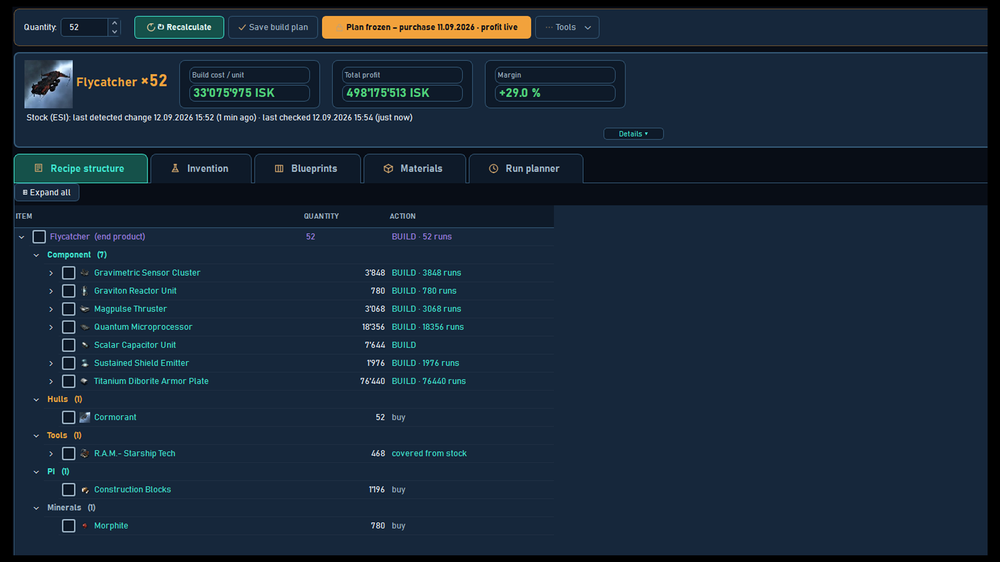

# EVE Motor Market

Industry and trading tool for EVE Online — for players who build and trade
across several characters.

**[Download the latest release](https://github.com/PeanutMotor/eve-motor-market/releases)** · Windows 10 or later · GPL-3.0

## Build

- Full recipe tree from the finished item down to ore and reactions.
- ME/TE taken from your own blueprints.
- Run planner spreads the jobs across your characters by skills and job slots.
- Shopping list with order-book prices; saved plans reserve their material, so
  you never buy the same stack twice.

## Trade

- Trade journal with real profit after your own sales tax and broker fees.
- Deal finders: daytrade, swing and regional.
- Order update shows which of your orders were undercut.

## Multi-character

Link as many characters as you like. Wallets, orders, assets, skills and
industry jobs are combined — one view across all of them.

## Install

Download the `.exe` from
[Releases](https://github.com/PeanutMotor/eve-motor-market/releases) and run it.
Windows 10 or later. Windows warns on first launch because the file is not
code-signed — click "More info", then "Run anyway".

A one-time setup links your first character and downloads the recipe data
(about 140 MB).

## Source code

The full source is in this repository, and is also attached to every release as
a zip, under the GPL-3.0 licence. You may read it, change it and pass it on; a
changed version has to come with its own source under the same licence.

## Checks

Numbers are what the tool is for, so the calculations are guarded rather than
trusted. The repository ships the check tooling alongside the program:

- two test suites, 3'941 and 1'307 checks, run with `python pruefe.py`
- a mutation harness (`rotprobe.py`) that breaks the code on purpose, 1006
  mutations, to prove the checks actually catch a regression
- source-order lint, `pyflakes`, and six scanners that keep the English and
  German texts in step

`bash start.sh` runs the lot and prints the expected result at the end.

## Community

Questions, bug reports and ideas: [Discord](https://discord.gg/Atuqe6c2Rj).

## Your data

Everything stays on your machine, in `%APPDATA%\EVE Motor Market`. The tool
connects only to `login.eveonline.com`, `esi.evetech.net`,
`images.evetech.net`, `www.fuzzwork.co.uk` (recipe data) and `api.github.com`
(update check).

---

Not a CCP Games product, not endorsed by CCP. The developer has signed the EVE
Online Developer License Agreement. EVE Online and all related trademarks belong
to CCP hf.
